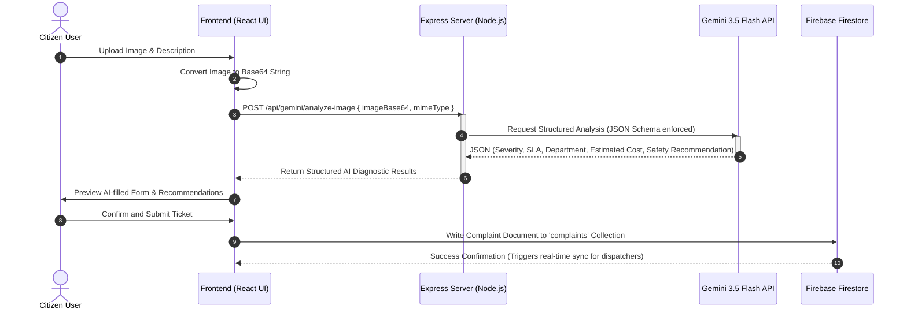
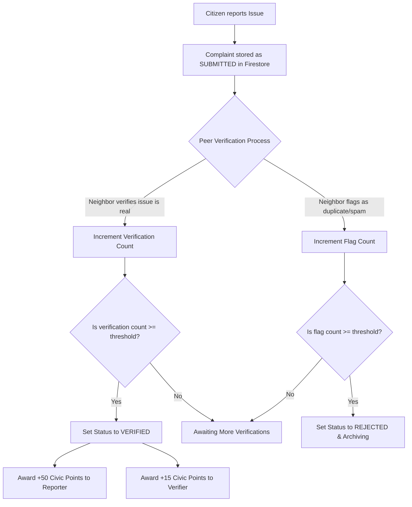

# CivicPulse AI

> **Smarter Communities & Intelligent Municipal Dispatching Powered by Google GenAI & Firebase**

CivicPulse AI is a state-of-the-art, full-stack civic engagement and municipal automation platform. It empowers citizens to report local infrastructure, sanitation, and safety issues while enabling municipal officers and AI Dispatchers to intelligently triage, prioritize, and resolve them in real time.

---

## 📋 Table of Contents
1. [Problem Statement Selected](#-problem-statement-selected)
2. [Solution Overview](#-solution-overview)
3. [Key Features](#-key-features)
4. [Interactive Architecture & Workflows (Mermaid Diagrams)](#-interactive-architecture--workflows-mermaid-diagrams)
5. [Technologies Used](#-technologies-used)
6. [Google Technologies Utilized](#-google-technologies-utilized)
7. [Installation & Setup](#-installation--setup)

---

## 🔍 Problem Statement Selected

### Community Hero - Hyperlocal Problem Solver
**Background**

Communities frequently face issues such as potholes, water leakages, damaged streetlights, waste management concerns, and public infrastructure challenges. Reporting these issues is often fragmented, difficult to track, and lacks transparency.

**Challenge**

Build a platform that enables citizens to identify, report, validate, track, and resolve community issues through collaboration, data, and intelligent automation.
The solution should encourage transparency, accountability, and community participation.

**Example Features:**

* Image and video-based issue reporting
* AI-powered issue categorization
* Geo-location and mapping
* Community verification
* Real-time issue tracking
* Impact dashboards
* Predictive insights
* Gamification for citizen engagement

**Evaluation Focus**

The solution should demonstrate how AI can help communities address local challenges more efficiently through improved reporting, verification, tracking, and resolution of issues.


---

## 💡 Solution Overview

**CivicPulse AI** bridges the gap between community members and municipal operators by converting visual raw reports into structured, actionable, and verified work orders using multi-agent AI pipelines and real-time synchronization.

```
   ┌─────────────────┐       Raw Image / Text       ┌────────────────────────┐
   │  Citizen App    │ ───────────────────────────> │  Express Backend API   │
   │  (React + Vite) │ <─────────────────────────── │  (Google GenAI SDK)    │
   └────────┬────────┘      AI Metadata / Chat      └───────────┬────────────┘
            │                                                   │
            │ Read / Write                                      │ Store / Read
            ▼                                                   ▼
   ┌─────────────────────────────────────────────────────────────────────────┐
   │                        Firebase Cloud Firestore                         │
   │        (Complaints, Users, Leaderboards, Department Workloads)         │
   └─────────────────────────────────────────────────────────────────────────┘
```

The application's core architecture relies on:
* **Decentralized Citizen Verification (Web3-Style Gamification)**: A system where points are earned through verified reports (+50 pts), community peer verifications (+15 pts), and resolution evidence (+50 pts). Points are redeemed for tangible public rewards (e.g., Delhi Metro passes, shopping coupons, green transit kits).
* **Multi-Agent AI Coordination**:
  * **Agent 1 (Municipal Diagnostics)**: A server-side image analysis model running on `gemini-3.5-flash` that ingests citizen photos, classifies them into six target municipal departments, calculates severity, SLA, estimated repair cost (in INR), environmental impact, and provides a structured safety recommendation.
  * **Agent 2 (CivicAI Chat Assistant)**: A context-aware chat partner that accesses the live Firestore database and current session context to assist citizens in English and Hindi, locating neighborhood complaints, explaining civic processes, and offering immediate emergency numbers.

---

## 🚀 Key Features

### 1. AI-Driven Visual Diagnostics
* Citizens upload a photo of a community issue.
* The system invokes a server-side route running `gemini-3.5-flash` to execute a structured computer vision analysis.
* It auto-fills ticket forms with high precision: title, descriptive text, department assignment, severity levels, repair cost estimates, and neighborhood impact.

### 2. Live Citizen & Officer Dashboards
* **Citizen View**: Focuses on submitting issues, verifying community posts on an interactive map, and tracking progress indicators.
* **Officer View (Municipal Desk)**: A command center displaying active workloads, real-time AI dispatcher operations, and department-wise active complaints.

### 3. Gamified Points & Rewards Economy
* Interactive Rewards Desk where citizens redeem earned civic points for physical items or public services.
* Integrated live **Leaderboard** highlighting community champions to foster healthy civic action.

### 4. Contextual CivicAI Assistant
* Responsive sidebar chat assistant supporting multilingual toggling (English ↔ Hindi).
* Automatically ingests local neighborhood complaints from the Firestore instance to provide personalized status reports.

### 5. Seamless Theme Engine
* Interactive light, dark, and system theme configurations accessible instantly through the main navigation menu and user settings.

---

## 📊 Interactive Architecture & Workflows (Mermaid Diagrams)

### Workflow 1: Visual Complaint Submission & Intelligent AI Triage
This workflow represents the lifecycle of a complaint from the initial image snap to automatic department dispatching.



---

### Workflow 2: Peer-to-Peer Community Verification & Gamified Rewards
To prevent spam, CivicPulse AI leverages peer validation, rewarding citizens for maintaining high-quality reports.



---

### Workflow 3: Interactive CivicAI Multilingual Assistant Workflow
The user-assistant loop with live contextual injection of community events.

```mermaid
flowchart TD
    A[Citizen Opens CivicAI Chat] --> B[Fetch Active Neighborhood Complaints from Firestore]
    B --> C[Inject User Profile & Active Complaints into System Prompt]
    C --> D[Citizen types question: 'Is the pothole on Main St being fixed?']
    D --> E[POST /api/gemini/chat { messages, userContext, language }]
    E --> F[Gemini 3.5 Flash analyzes question relative to context]
    F --> G[Generate helpful response in Hindi/English with real SLA metrics]
    G --> H[Display responsive message in Assistant interface]
```

---

## 🛠️ Technologies Used

### Frontend Architecture
* **React 19 & TypeScript**: Provides a robust, type-safe interface component library.
* **Vite**: Ultra-fast next-generation build toolchain.
* **Tailwind CSS v4**: Utility-first styling framework driving fluid grid layouts and transitions.
* **Framer Motion**: Smooth entry layouts and micro-interactions.
* **Recharts & D3**: Responsive charts plotting municipal workloads, resolution timelines, and active SLA statistics.
* **Lucide React**: Unified icon set.

### Backend Infrastructure
* **Express & Node.js**: High-performance HTTP routing layer.
* **ESBuild**: Used for bundling the production server entry point (`server.ts`) into a streamlined, high-speed `dist/server.cjs` bundle.
* **TSX**: Execute TypeScript files instantly during local development.

---

## 🌐 Google Technologies Utilized

### 1. Google GenAI SDK (`@google/genai`)
The platform leverages the cutting-edge `@google/genai` TypeScript SDK to interact with **`gemini-3.5-flash`** for heavy server-side cognitive and vision workloads:
* **Structured JSON Outputs**: Enforced using strict `responseSchema` constraints during image diagnosis to ensure immediate parser compatibility.
* **System Instructions**: Configured dynamic context mapping to inject localized emergency contacts and active user statistics.

### 2. Firebase Cloud Firestore
A highly-scalable cloud NoSQL database powering real-time client-side synchronization:
* **Real-time Subscriptions (`onSnapshot`)**: Powers live issue feeds, notification counters, and officer dispatch trackers without expensive polling loops.
* **Secure Rules**: Configured to restrict write access to authenticated owners while allowing global read queries on active public hazards.

### 3. Firebase Authentication
Provides secure, cloud-hosted identity management supporting email/password registers and Google Auth Popups, seamlessly mapping users to `citizen` or `officer` permission scopes.

### 4. Google Maps Platform
Integrated via `@vis.gl/react-google-maps` to geolocate civic complaints, allowing citizens and dispatcher teams to visualize community hazards on a geographical canvas.

---

## ⚙️ Installation & Setup

1. **Install Base Dependencies**:
   ```bash
   npm install
   ```

2. **Configure Environment Variables**:
   Create a `.env` file at the root of your application with the following configurations:
   ```env
   # Google Gemini API Credentials
   GEMINI_API_KEY=your_gemini_api_key_here
   ```

3. **Run the Development Workspace**:
   ```bash
   npm run dev
   ```
   *The development server will mount Vite middleware and start listening on [http://localhost:3000](http://localhost:3000).*

4. **Compile Production Bundle**:
   To test the production compilation pipelines:
   ```bash
   npm run build
   ```
   *This compiles the React static SPA assets into the `/dist` directory and bundles the Express Node server into `/dist/server.cjs`.*
