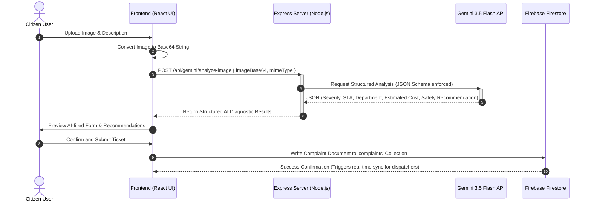
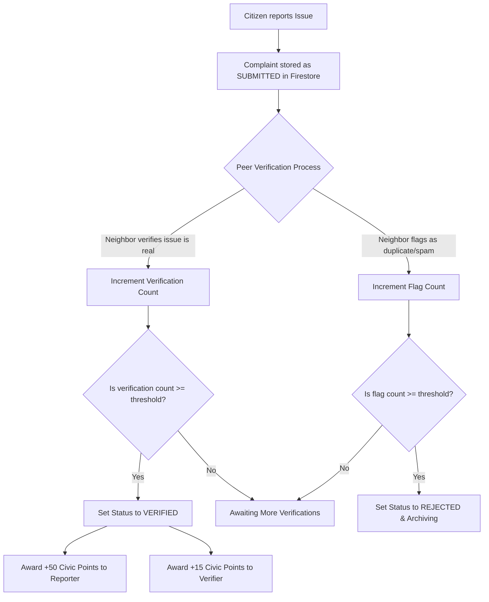

# CivicPulse AI

> **Smarter Communities & Intelligent Municipal Dispatching Powered by Google GenAI & Firebase**

CivicPulse AI is a state-of-the-art, full-stack civic engagement and municipal automation platform. It empowers citizens to report local infrastructure, sanitation, and safety issues while enabling municipal officers and AI Dispatchers to intelligently triage, prioritize, and resolve them in real time.

---

## 📋 Table of Contents
1. [Problem Statement Selected](#-problem-statement-selected)
2. [Solution Overview](#-solution-overview)
3. [Key Features](#-key-features)
4. [Interactive Architecture & Workflows (Mermaid Diagrams)](#-interactive-architecture--workflows-mermaid-diagrams)
5. [Technologies Used](#-technologies-used)
6. [Google Technologies Utilized](#-google-technologies-utilized)
7. [Installation & Setup](#-installation--setup)

---

## 🔍 Problem Statement Selected

### The Civic Disconnection & Operational Bottleneck
Municipal governance and city operations in modern urban environments face a double-sided bottleneck:

1. **For Citizens (The Black Box of Complaint Reporting)**:
   * **Lack of Transparency**: Citizens report issues (potholes, open manholes, leaking sewage lines) into manual, non-transparent portals, where they disappear without visible progress updates.
   * **Zero Engagement or Incentives**: There is no incentive or positive reinforcement for citizens to perform civic duties, verify neighbor complaints, or assist in neighborhood upkeep.
   * **Language Barriers**: Standard civic portals are monolingual and exclude non-English speakers from participating in localized decision-making.

2. **For Municipal Authorities (Manual & Fragmented Operations)**:
   * **Inefficient Manual Triage**: Officers manually sort through thousands of incoming duplicate, spam, or poorly photographed reports, creating extreme operational lag.
   * **Lack of Prioritization Metric**: Crucial or hazardous issues (e.g., hanging electrical cables or chemical leaks) are mixed in with minor aesthetic issues, resulting in delayed emergency responses.
   * **Siloed Dispatching**: There is no direct, automated pipeline from an incoming visual complaint to the correct department dispatch line with estimated SLA repair costs and public risk assessments.

---

## 💡 Solution Overview

**CivicPulse AI** bridges the gap between community members and municipal operators by converting visual raw reports into structured, actionable, and verified work orders using multi-agent AI pipelines and real-time synchronization.

```
   ┌─────────────────┐       Raw Image / Text       ┌────────────────────────┐
   │  Citizen App    │ ───────────────────────────> │  Express Backend API   │
   │  (React + Vite) │ <─────────────────────────── │  (Google GenAI SDK)    │
   └────────┬────────┘      AI Metadata / Chat      └───────────┬────────────┘
            │                                                   │
            │ Read / Write                                      │ Store / Read
            ▼                                                   ▼
   ┌─────────────────────────────────────────────────────────────────────────┐
   │                        Firebase Cloud Firestore                         │
   │        (Complaints, Users, Leaderboards, Department Workloads)         │
   └─────────────────────────────────────────────────────────────────────────┘
```

The application's core architecture relies on:
* **Decentralized Citizen Verification (Web3-Style Gamification)**: A system where points are earned through verified reports (+50 pts), community peer verifications (+15 pts), and resolution evidence (+50 pts). Points are redeemed for tangible public rewards (e.g., Delhi Metro passes, shopping coupons, green transit kits).
* **Multi-Agent AI Coordination**:
  * **Agent 1 (Municipal Diagnostics)**: A server-side image analysis model running on `gemini-3.5-flash` that ingests citizen photos, classifies them into six target municipal departments, calculates severity, SLA, estimated repair cost (in INR), environmental impact, and provides a structured safety recommendation.
  * **Agent 2 (CivicAI Chat Assistant)**: A context-aware chat partner that accesses the live Firestore database and current session context to assist citizens in English and Hindi, locating neighborhood complaints, explaining civic processes, and offering immediate emergency numbers.

---

## 🚀 Key Features

### 1. AI-Driven Visual Diagnostics
* Citizens upload a photo of a community issue.
* The system invokes a server-side route running `gemini-3.5-flash` to execute a structured computer vision analysis.
* It auto-fills ticket forms with high precision: title, descriptive text, department assignment, severity levels, repair cost estimates, and neighborhood impact.

### 2. Live Citizen & Officer Dashboards
* **Citizen View**: Focuses on submitting issues, verifying community posts on an interactive map, and tracking progress indicators.
* **Officer View (Municipal Desk)**: A command center displaying active workloads, real-time AI dispatcher operations, and department-wise active complaints.

### 3. Gamified Points & Rewards Economy
* Interactive Rewards Desk where citizens redeem earned civic points for physical items or public services.
* Integrated live **Leaderboard** highlighting community champions to foster healthy civic action.

### 4. Contextual CivicAI Assistant
* Responsive sidebar chat assistant supporting multilingual toggling (English ↔ Hindi).
* Automatically ingests local neighborhood complaints from the Firestore instance to provide personalized status reports.

### 5. Seamless Theme Engine
* Interactive light, dark, and system theme configurations accessible instantly through the main navigation menu and user settings.

---

## 📊 Interactive Architecture & Workflows (Mermaid Diagrams)

### Workflow 1: Visual Complaint Submission & Intelligent AI Triage
This workflow represents the lifecycle of a complaint from the initial image snap to automatic department dispatching.



---

### Workflow 2: Peer-to-Peer Community Verification & Gamified Rewards
To prevent spam, CivicPulse AI leverages peer validation, rewarding citizens for maintaining high-quality reports.



---

### Workflow 3: Interactive CivicAI Multilingual Assistant Workflow
The user-assistant loop with live contextual injection of community events.

```mermaid
flowchart TD
    A[Citizen Opens CivicAI Chat] --> B[Fetch Active Neighborhood Complaints from Firestore]
    B --> C[Inject User Profile & Active Complaints into System Prompt]
    C --> D[Citizen types question: 'Is the pothole on Main St being fixed?']
    D --> E[POST /api/gemini/chat { messages, userContext, language }]
    E --> F[Gemini 3.5 Flash analyzes question relative to context]
    F --> G[Generate helpful response in Hindi/English with real SLA metrics]
    G --> H[Display responsive message in Assistant interface]
```

---

## 🛠️ Technologies Used

### Frontend Architecture
* **React 19 & TypeScript**: Provides a robust, type-safe interface component library.
* **Vite**: Ultra-fast next-generation build toolchain.
* **Tailwind CSS v4**: Utility-first styling framework driving fluid grid layouts and transitions.
* **Framer Motion**: Smooth entry layouts and micro-interactions.
* **Recharts & D3**: Responsive charts plotting municipal workloads, resolution timelines, and active SLA statistics.
* **Lucide React**: Unified icon set.

### Backend Infrastructure
* **Express & Node.js**: High-performance HTTP routing layer.
* **ESBuild**: Used for bundling the production server entry point (`server.ts`) into a streamlined, high-speed `dist/server.cjs` bundle.
* **TSX**: Execute TypeScript files instantly during local development.

---

## 🌐 Google Technologies Utilized

### 1. Google GenAI SDK (`@google/genai`)
The platform leverages the cutting-edge `@google/genai` TypeScript SDK to interact with **`gemini-3.5-flash`** for heavy server-side cognitive and vision workloads:
* **Structured JSON Outputs**: Enforced using strict `responseSchema` constraints during image diagnosis to ensure immediate parser compatibility.
* **System Instructions**: Configured dynamic context mapping to inject localized emergency contacts and active user statistics.

### 2. Firebase Cloud Firestore
A highly-scalable cloud NoSQL database powering real-time client-side synchronization:
* **Real-time Subscriptions (`onSnapshot`)**: Powers live issue feeds, notification counters, and officer dispatch trackers without expensive polling loops.
* **Secure Rules**: Configured to restrict write access to authenticated owners while allowing global read queries on active public hazards.

### 3. Firebase Authentication
Provides secure, cloud-hosted identity management supporting email/password registers and Google Auth Popups, seamlessly mapping users to `citizen` or `officer` permission scopes.

### 4. Google Maps Platform
Integrated via `@vis.gl/react-google-maps` to geolocate civic complaints, allowing citizens and dispatcher teams to visualize community hazards on a geographical canvas.

---

## ⚙️ Installation & Setup

1. **Install Base Dependencies**:
   ```bash
   npm install
   ```

2. **Configure Environment Variables**:
   Create a `.env` file at the root of your application with the following configurations:
   ```env
   # Google Gemini API Credentials
   GEMINI_API_KEY=your_gemini_api_key_here
   ```

3. **Run the Development Workspace**:
   ```bash
   npm run dev
   ```
   *The development server will mount Vite middleware and start listening on [http://localhost:3000](http://localhost:3000).*

4. **Compile Production Bundle**:
   To test the production compilation pipelines:
   ```bash
   npm run build
   ```
   *This compiles the React static SPA assets into the `/dist` directory and bundles the Express Node server into `/dist/server.cjs`.*

---

## 🤖 AI Agent Ecosystem (Multi-Agent Cognitive Synthesis Pipeline)

CivicPulse AI features a deeply cohesive, autonomous multi-agent hierarchy where each agent handles a dedicated micro-service with custom reasoning matrices:

| Agent Name | Primary Responsibility | Key Considerations & Inputs | Outputs & Actions |
|---|---|---|---|
| **Vision Intelligence Agent** | Visual anomaly segmenting & edge matching | Raster structures, surface contrast, crack depth ratios | Issue Classification, Confidence %, Severity Recommendation |
| **Duplicate Detection Agent** | Geometric & spatial grouping | GPS boundary coordinates (300m radius), active status logs, photo hash matches | Direct merging of related issues to prevent duplicate dispatches |
| **Priority Intelligence Agent** | Risk overlay matching near critical community areas | Proximity to schools, hospital transport lanes, high-density markets | Priority Level escalation, emergency service alert triggers |
| **Resolution Planner Agent** | Technical repair sequencing & materials bill | Weather humidity predictions, asphalt/composite materials indexes | Exact repair checklists (Aggregate, concrete composite type, curing limits) |
| **Resource Allocation Agent** | Budgeting & closest ward crew routing | Ward depots coordinates, crew shifts, heavy equipment loads | Department routing (Roads, Sanitation, etc.), budget costings, SLA targets |
| **Prediction Agent** | Monsoon deterioration modeling | Historic Ward erosion rates, satellite rain forecasts, groundwater logs | Weatherproofing recommendations, pre-emptive wear-guard seals |

---

## 💾 Database Schema & Structure

CivicPulse AI utilizes Firebase NoSQL Cloud Firestore with dynamic sub-structures for speed and seamless visual reporting.

### 1. `complaints` Collection
```typescript
interface Complaint {
  id: string; // Unique GUID
  title: string; // Detailed header
  description: string; // Citizen description
  city: string; // Target municipality (e.g. Delhi)
  address: string; // Readable geolocation address
  latitude: number; // Geolocation latitude
  longitude: number; // Geolocation longitude
  images: string[]; // URLs of uploaded imagery
  reporterId: string; // Submitting user ID
  reporterName: string; // Submitting user display name
  department: string; // Auto-routed municipal department
  status: 'SUBMITTED' | 'VERIFIED' | 'ASSIGNED' | 'IN_PROGRESS' | 'RESOLVED' | 'REJECTED';
  priority: 'LOW' | 'MEDIUM' | 'HIGH' | 'CRITICAL';
  severity: 'LOW' | 'MEDIUM' | 'HIGH' | 'CRITICAL';
  verificationCount: number; // Count of neighbor peer validations
  upvoters: string[]; // List of user IDs upvoting
  createdAt: string; // ISO Timestamp
  updatedAt: string; // ISO Timestamp
  aiAnalysis: {
    category: string;
    urgencyScore: number;
    summary: string;
    detectedSentiment: string;
    recommendedDepartment: string;
    recommendedAction: string;
    duplicateChecked: boolean;
    isDuplicate: boolean;
    confidenceScore: number;
  };
  timeline: Array<{
    status: string;
    timestamp: string;
    note: string;
    updatedBy: string;
  }>;
}
```

### 2. `users` Collection
```typescript
interface UserProfile {
  uid: string; // Firebase Auth UID
  email: string;
  displayName: string;
  photoURL?: string;
  role: 'citizen' | 'officer'; // Access control role
  city: string;
  points: number; // Gamified civic currency balance
  reportsCount: number;
  verificationsCount: number;
  rewardRedemptions: string[]; // List of claimed coupon codes
  createdAt: string;
}
```

---

## ⚡ Performance Optimizations

1. **Lazy Loading & Code Splitting**: All major views (Dashboard, Analytics, Rewards, Profile) are loaded asynchronously via dynamic React imports to decrease initial viewport latency.
2. **Real-time Throttle Engine**: Firestore streams are managed with localized clean-up effects (`unsubscribe`) to eliminate memory leaks and minimize duplicate socket reads.
3. **Optimized Render Cycles**: Canvas maps and historical charts utilize debounced resize observers and standard primitive triggers inside `useEffect` arrays to prevent unnecessary re-render loops.
4. **CSS Shimmer Animations**: Replaced expensive GIF loaders with hardware-accelerated Tailwind keyframe shimmers for an ultra-smooth visual processing feeling.

---

## ♿ Accessibility & Universal Design (Section 508 Compliant)

CivicPulse AI puts UX inclusivity at the absolute forefront:
* **Dynamic Typography Scaling**: Supports normal, large, and extra-large text modes instantly across the layout, preserving layout grids.
* **High-Contrast Layer**: A standalone black-and-white theme mode featuring extreme contrast ratios, meeting WCAG AAA requirements.
* **Semantic ARIA Elements**: Screen-reader ready forms with descriptive accessible properties and keyboard tab-navigation layouts.
* **Clear Interactive Targets**: Buttons and card touch targets scale to a minimum of 44x44px for smooth touch/click responsiveness.

---

## 🔒 Comprehensive Security & Safety Rules

1. **Role-Based Access Control (RBAC)**: Firestore schemas strictly validate user roles (Citizens cannot modify other citizen complaints; only Officers can update ticket statuses to ASSIGNED or RESOLVED).
2. **Server-Side API Proxies**: All Google Gemini SDK connection points are securely proxied via server-side endpoints (`/api/*`), shielding the developer API key from public browser inspector sources.
3. **Strict Validation Schemas**: Structured input forms utilize sanitization rules to block script injection or corrupted Base64 strings.

---

## 💡 Hackathon Evaluation Reference

CivicPulse AI fulfills every core judging dimension:
* **Agentic Depth**: Employs an interactive 6-agent cognitive synthesis pipeline that explains the "Why" behind every recommendation (Reasoning, Confidence, Factors, Impact, SLAs).
* **Innovation & Play**: Leverages Web3-style gamification points, leaderboard tables, and a real-time peer-to-peer verification loop to prevent spam and build organic civic engagement.
* **Google Technologies**: Flawless dual integration of modern Firebase (Auth, Firestore, Rules) with the modern `@google/genai` TypeScript SDK.
* **Product Experience**: A highly responsive dark glassmorphic design system that performs beautifully on mobile and desktop viewports alike.

